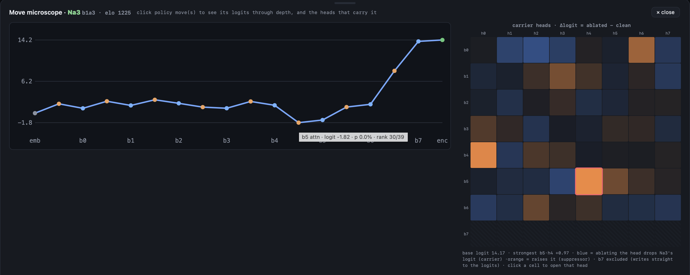

## Chessformer_lens
#### A toolkit + visualizer library designed for mechanstic interpretability of transformer based chess models.


This project was spurred by the surprising lack of infrastructure for analyzing chess engines. Chessformer_lens is both an interface for interactive visualization and rigorous  interpretability functionality—especially inspired by Neel Nanda's transformer_lens library.

(The **Maia-3** model interpreter is completed; **Leela** will be completed soon. Both of these treat each square as a token—which allows for beautiful board readable attention patterns. Eventually other tokenization schemes will be tackled).
<-------------------------------------------------------------------->


Chess is unusually good for AI interpretability because it requires complex and structured reasoning in a compact domain, and it has a hiearchy of human concepts (squares -> threats -> tactics -> strategy) which can provide deep insight into how AI carves features.

Transformer based chess models ("chessformer") are a good lens for studying LLMs because outputs have a clear ground source for the evaluation of a move and so avoid the vagueness of language, because attention functions with clearly interpretable roles on a chess board, and because informative chessformer results are straightforward to scale and investigate in LLMs.

<-------------------------------------------------------------------->

This repo's core is **one engine** with **three frontends**:
`engine.py` is the interp core (model + hooks + logit lens + head ablation + list of values through depth). It does all of the analysis for:
- `app.py`
- `interp_plot.py`
- `interp_widget.py`

Users are encouraged to read the user guides for each of these modules which can be found at the top of the respective scripts.

*interp_plot.py functions **plot_logit_curve** and **plot_carrier_heads***

## Quickstart in colab or notebook:
<-------------------------------------------------------------------->
Recall that FEN is the modern notation for a chess position
```python
!pip install -q git+https://github.com/CSSLab/maia3
!pip install -q "chessformer_lens[plot] @ git+https://github.com/chessformer-lens/chessformer_lens"

import chess
from chessformer_lens import MaiaEngine
import chessformer_lens.interp_widget as iw

eng = MaiaEngine()          
# Opera Game FEN right at legendary queen sacrifice 
fen = "4kb1r/p2n1ppp/4q3/4p1B1/4P3/1Q6/PPP2PPP/2KR4 w k - 0 16" 
# [or insert another FEN string]

try:
    board = chess.board(fen)
except ValueError as e:
    print("Invalid FEN: {e})     

#Interact with the attention widget
#click between different layers and heads in the widget
iw.attention_widget(eng, board, 1500,layer=4,head=3) 
```
<-------------------------------------------------------------------->
## The app

To me, the app is the pièce de résistance and usage should be rather intuitive, nonetheless, a detailed guide can be found in `app.py`.


Play a transformer-based chess bot ("chessformer") and watch
its move policy, its attention (both semantic QKᵀ and unique geometric GAB), and its residual stream 
evolve with model depth. The model loads on a background thread so the window opens instantly.
<-------------------------------------------------------------------->

### Run locally
`chessformer_lens` is a normal Python package, but `engine.py` currently needs `maia3`: the Maia-3 model code, installed first. 
Below also installs torch, numpy, python-chess, huggingface-hub and ipython.

**In terminal:**
```bash
pip install git+https://github.com/CSSLab/maia3
pip install "chessformer_lens[all] @ git+https://github.com/chessformer-lens/chessformer_lens"
python3 -m venv .venv && source .venv/bin/activate
pip install -r requirements.txt
#Various ways to launch, note that higher parameter models have 16 and 32 heads per layer, and 512 and 1024 dim of the model (d_model):
chessformer-lens
chessformer-lens 23m               
chessformer-lens --model maia3-79m 
MAIA3_ALIAS=5m chessformer-lens   
```

<!-- understand about set `MAIA3_DEVICE=mps` (Apple Silicon) or run on
CUDA to speed higher parameter models up. Model weights: <https://huggingface.co/UofTCSSLab> -->

### Example practical usage in python
Quick interpretability demo: **attention layer 5 head 5 is causally linked to detecting knight forks**
```python
#Gather a couple of positions with knight forks and ablate every head in the model to see which impacts the output most
knight_forks = [
['1r2k3/3qn3/3p4/p2P1Pp1/PpP3Np/1P3Q1P/3K1PP1/7R w - - 0 37', 'g4f6'], 
['5b2/6p1/3p2k1/2p3pn/7r/8/P2NKPQ1/R6R b - - 2 25','h5f4'],
['6k1/5p1p/p3p1p1/1p2n3/1P1q4/P2p2P1/3Q1N1P/6K1 b - - 2 37', 'e5f3'],
['rn1q1knr/pb2p1b1/6p1/5pN1/1pPP3p/1P6/P1B2PPP/1RQ2RK1 w - - 2 20', 'g5e6'],
['5r1k/3nrBp1/b1pp1n1p/p3q2P/Pp2PN2/3PB1Q1/1PP3P1/2KR3R w - - 1 22', 'f4g6'], 
['6k1/1pq2ppp/p7/3p4/1P1Nn3/P2QPP2/1B4Pb/7K b - - 1 26', 'e4f2'], 
['4r1k1/6b1/3p2pp/3Pnp2/4N2Q/6P1/P1q2P1P/4R1K1 b - - 0 26', 'e5f3'], 
['5rk1/pp5p/2p1p1p1/6N1/3PQBP1/2q4P/P7/3n3K b - - 1 25', 'd1f2'], 
['r2q1rk1/ppp3p1/3ppn1B/2b1p3/3nP3/3P2QN/PPP2PPP/RN3RK1 b - - 2 11', 'd4e2'],
['r1b2rk1/1pp2p1p/4p1p1/2PqP3/p1nPN2B/P1PQ4/6PP/R4RK1 w - - 2 21', 'e4f6']]

for fen, move in knight_forks:
    board = chess.Board(fen)
    display_board(board, move=move)
    show(ip.plot_carrier_heads(eng, board, 2400, move))
```

### Code layout: all found within the chessformer_lens package
- `__init__.py` — the package surface: `MaiaEngine`, `build_cfg`, `pick_device`, `attention_widget`, `gab_widget`, `__version__`.
- `engine.py` — `MaiaEngine`: the interp core (model + hooks + logit lens + head ablation + list of values through depth). No UI deps; imports cleanly in a notebook.
- `interp_plot.py` — matplotlib figures that the app uses
- `interp_widget.py` — the app's two interactive panels as a self-contained notebook cell or standalone HTML page
- `piece_art.py` — draws `pieces.py`'s cburnett pieces in matplotlib from PNGs
- `bridge.py` — the game state + the JSON API the UI calls.
- `ui.py` — the whole interface (HTML/CSS/JS) as one string including guide to change template.
- `pieces.py` — SVG piece set as data URIs.
- `app.py` — app launcher (native window via pywebview); the `chessformer-lens` command is its `main()`.


### Notes

Please don't hesitate to give me feedback by email or at **davidlitman.com**. I intend for this to be a useful and intuitive tool for the community.


Maia-3 comes from:
Chessformer / Maia-3 (Monroe et al., ICLR 2026).
Model weights: <https://huggingface.co/UofTCSSLab/Maia3-5M>


### Citing
If `chessformer_lens` contributes to published work, a citation is very appreciated and helps others find it! Please see
`CITATION.cff` and GitHub's "Cite this repository" button.
