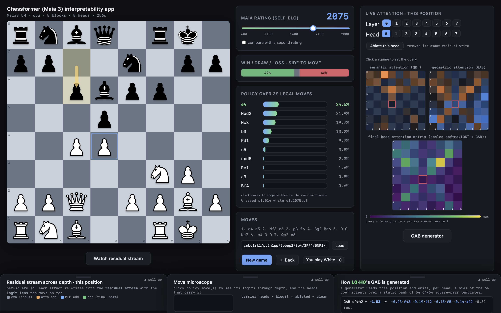

# Chessformer interpretability

This toolkit+visualizer is designed for mech interp researchers working with chess models that use transformers tokenized by square.



Chess tranformers are good interp subjects because **[copy from paper]**

<!-- WHAT THIS IS — TO WRITE. Three short paragraphs:
     1. WHY chess transformers are good interp subjects. They read the board as
        64 square tokens and emit a policy over moves, so every activation is
        indexed by a *square* — an attention row, a residual delta, an ablation
        effect can all be drawn back onto the board and just looked at. This is
        the argument the whole project rests on; the README has never said it.
     2. ONE ENGINE, THREE FRONTENDS. engine.py captures the residual stream at
        every sub-layer and owns all the analysis; the app, the figure layer and
        the widgets are views onto it. Nothing in engine.py imports the UI.
     3. SCOPE, HONESTLY. The methods are architecture-general; the bundled
        loader targets the Maia-3 family (Monroe et al., ICLR 2026), every
        released size 3M-79M. Any checkpoint with the same Post-LN block
        structure drops into MaiaEngine.
-->

## What it can do

- **Logit Lens Across Depth**: decode the running residual stream at all readout points {embed, attention_i, mlp_j,unembed}, and watch a move form layer by layer
- **Per Head Causal Ablation**: remove a head's exact residual write, reconstructed from the layer's own weights. Uses the models' placed hooks on attention layers. Also, sweep every head to get a carrier/supressor heatmap.
- **Dissect positional encoding GAB heads**: A small generator network reads
the board and emits, per head, linear combinations of a bank of 64×64 square-pair templates shared across every layer and head for its geometric attention head called GAB (a head does not
have a fixed geometry). Expose the static template bank each layer shares, the linear combination of these templates each head learns per position, and any single (to, from) square pair decomposed into its top templates.
- **Activation Patching**: run_with_hooks takes arbitrary intervention functions on any readout point, allowing for patching and steering.
- **Skill Axis**: Maia-3 conditions on a rating, so you can run one position at two ratings and compare the internals. This is a genuinely unusual and inspiring capaility; almost no other top model has a skill axis that allows for meaningful mech interp with skill acquisition. Highly recommended.


## Quickstart in colab:
<-------------------------------------------------------------------->
```python
!pip install -q git+https://github.com/CSSLab/maia3
!git clone -q https://github.com/David-31415/chessformer_interp.git
%cd chessformer_interp

#Interact with the attention widget
import chess
from engine import MaiaEngine
import interp_widget as iw

eng = MaiaEngine()                      # or "maia3-23m"; downloads on first use
board = "...fill in FEN for position..."
board = chess.Board(board)                   # starting position, or pass a FEN

iw.attention_widget(eng, board, 1500,layer=4,head=3) # click between different layers and heads in the widget
```
<-------------------------------------------------------------------->


## The app

**Play or Set up a Position**

Click to move your pieces. Select an Elo for the engine (recall that it mimics *human* play at that strength)
and use `New game`, `← Back`, and a dropdown:`You play White` / `You play Black` / `Set up position`.
It is also possible to `paste a FEN to load` a position with the `Load` button. 

In setup mode both sides are yours; clicks move pieces ignoring legality, and clicking the same square twice deletes the piece. 
Select a color to continue as it from that position.

The last move is indicated by a gold arrow, legal moves for a selected piece are indicated by dots, captures are drawn as rings. The games
moves are recorded in SAN notation.

Header line reads `Maia3 5M · cpu · 8 blocks × 8 heads × 256d`. **[THIS IS OUTDATED]**

**Read the Position**

At the top in the center there is a `Win / Draw / Loss · side to move` stacked bar. 
Under it is the `Maia rating (self_elo)` slider: 600-2800, step 25, default 1500; Dragging reevaluates the same position. 
Under that it is the scrollable ranked list: `Policy over N legal moves`. 

There is a `compare with a second rating` checkbox which reveals a `second rating` slider
(default 1100). Setting it makes the policy rows become paired blue/green bars showing the compared policy and evaluation. This second rating does not affect the attention or GAB or residual panel app features.

**Take the Model Apart**
Get the `Live attention · this position`, with `Layer` and `Head` chip rows.
Click a square to set the query for the three boards, labeled:
-`semantic attention (QKᵀ)`
-`geometric attention (GAB)`
-`final head attention matrix (scaled softmax(QKᵀ + GAB))`
`Ablate this head` (its note: `removes its exact residual write`) gives the top 8 moves by |Δp|.

Unique to the app and Maia-3, hover over any attention square and the GAB drawer decomposes that square pair live, with every head clickable to open that template.

 
**The Three Drawers**


One open at a time, each peeking at the bottom with a `▲ pull up` grip, `Escape` closes.

· `Residual stream across depth · this position` — creates a filmstrip of mini
  boards, one per readout point, top border color coded by writer kind, **[SAY MORE HERE]**
  heat = per-square ‖Δ‖, logit-lens top move in miniature display on top. Opened by the
  `Watch residual stream` button.

· `Move microscope (and Carrier Heads)` — click up to 4 policy moves to overlay their depth curves (essentially logit lens narrowed to one policy); marker shows when a move sustains rank-1; per-dot hover
ex: `b3 mlp · logit 4.21 · p 38.2% · rank 1/31`.
`carrier heads` runs (layers x heads) forward passes with different ablated heads and record: `Δlogit = ablated − clean`.Hover for exact values. The largest Δlogit head is ringed red. The final layer is dimmed and striped, `excluded from carrier attribution`, because it writes straight to the logits and muddles meaningful results from earlier layers. 

· `How L[i]H[j] GAB is generated` — see the network's generated linear combination of each template #0–63. `click to inspect`, and under
see `template vocabulary · the 64 static stencils (row = query sq, col = key sq)` as a gallery.


## Addional Notes
The model loads on a background thread so the window opens instantly; the layout reads the loaded model's counts so all sizes of Maia-3 with different head counts work the same. As of now, it opens in a native window and there is no export button or permalink for a session.

## Install as library

`engine.py` imports `maia3`, the Maia-3 model code, which is not on PyPI — it
installs from GitHub and pulls in torch, python-chess, numpy and
huggingface-hub. The library quickstarts below need the repo on your path *and*
that package installed; neither happens by uploading `engine.py` on its own.

Locally, `pip install -r requirements.txt` from a clone covers the same ground
(plus `pywebview` and `matplotlib`, which only the app and the figure layer
need). See [Run](#run) for the app itself.

interp_plot is the library's read-once views as static figures
<!-- TO WRITE: a sentence or two framing interp_plot as the app's read-once
     views as static figures. The code block below is accurate — keep as-is. -->


## The two live panels in a notebook

The app's two interactive panels also run as self-contained notebook cells (or
standalone HTML pages) via `interp_widget.attention_widget` / `gab_widget` —
the app's own JS with the data injected instead of fetched. (GitHub's .ipynb
viewer drops the iframe entirely, so on GitHub these cells look empty — the
srcdoc fallback never renders. Open in Colab or Jupyter.)

## Run

```bash
python3 -m venv .venv && source .venv/bin/activate
pip install -r requirements.txt
python app.py
```

The first launch downloads the Maia3-5M transformer weights (~20 MB) from
Hugging Face and a native window opens (no browser needed).

### Choosing a model size

The same interface drives every Maia-3 size — the GUI reads the loaded model's
block / head / dimension / GAB-template counts and lays itself out to match, so
`3m`, `5m`, `23m` and `79m` all just work.

| alias | blocks | heads | dim | GAB templates | ablation sweep |
|---|---|---|---|---|---|
| `3m` | 8 | 6 | 192 | 64 | 56 passes |
| `5m` (default) | 8 | 8 | 256 | 64 | 72 passes |
| `23m` | 8 | 16 | 512 | 128 | 136 passes |
| `79m` | 8 | 32 | 1024 | 128 | 264 passes |

<!-- Table verified against maia3.model_registry. Note `3m`'s registry display
     name is "Maia3 3M ablation" — don't call it plain 3M. -->

Pick one at launch:

```bash
python app.py 23m               # built-in alias: 3m / 5m / 23m / 79m
python app.py --model maia3-79m # full alias, HF repo id, or HF URL
MAIA3_ALIAS=23m python app.py   # env var (still supported)
```

Weights for the chosen size download on first use and are cached. Larger models
are heavier per position — on CPU the 23M/79M attention and head-ablation views
are noticeably slower than 5M; set `MAIA3_DEVICE=mps` (Apple Silicon) or run on
CUDA to speed them up. Model weights: <https://huggingface.co/UofTCSSLab>

## Use the engine directly


<!-- TO WRITE: a sentence or two. Point at engine.py's module docstring as the
     real reference rather than duplicating it — it's accurate now. Two facts
     worth stating: no UI dependency, and read paths return CPU tensors in the
     model's canonical side-to-move frame (square = rank*8 + file). -->

```python
import chess
from engine import MaiaEngine

eng = MaiaEngine()                      # or "maia3-23m"; downloads on first use
board = chess.Board()                   # starting position, or pass a FEN

out, cache = eng.run_with_cache(board, self_elo=1500)
eng.logit_lens(cache["postattn_04"], board)     # top legal move at that point
eng.run_with_hooks(board, 1500, fwd_hooks=[("attn_05", lambda a: a * 0)])
```

See the residual stream film and move microscope for the famous Paul Morphy "Opera Game"
```python
import chess
from engine import MaiaEngine
import interp_plot as ip

#opera game FEN right at legendary queen sacrifice 
fen = "4kb1r/p2n1ppp/4q3/4p1B1/4P3/1Q6/PPP2PPP/2KR4 w k - 0 16" 
import matplotlib.pyplot as plt

eng = MaiaEngine('23m')
board = chess.Board(fen)                   
move = eng.to_move(board,'Qb8+')
ip.plot_position(eng, board,2600)
plt.show()
print("\n\n")
ip.plot_residual_film(eng, board, 2600) #exceptional Elo rating to match Morphy's skill
plt.show()
print("\n\n")
ip.plot_move_microscope(eng, board, 2600, move)     # one move's depth curve + carrier heads
plt.show()
plt.close()
```

## Code layout

- `engine.py` — `MaiaEngine`: the interp core (model + hooks + logit lens + head ablation + list of values through depth). No UI deps; imports cleanly in a notebook.
- `interp_plot.py` — the app's read-once views as matplotlib figures, same layouts and wording: `plot_position`, `plot_residual_film`, `plot_move_microscope`, `plot_carrier_heads`, `plot_attention`, `plot_gab_mixture`, `plot_gab_templates`, `plot_skill_diff`. Engine + matplotlib only.
- `interp_widget.py` — the app's two interactive panels as a self-contained notebook cell or standalone HTML page: `attention_widget` (Live attention) and `gab_widget` (the GAB generator), plus their `*_html` twins; `ui.py`'s CSS, colormaps and interaction, reading injected data instead of the pywebview API. These are the interactive versions of `interp_plot`'s static `plot_attention` / `plot_gab_mixture`. Take the figure for one frame, the widget to explore.
- `piece_art.py` — draws `pieces.py`'s cburnett pieces in matplotlib from PNGs rasterised offline into `piece_art/`, so figures use the app's actual artwork with no native dependency at runtime (`piece_art/regenerate.py` rebuilds them, and needs cairosvg).
- `bridge.py` — the game state + the JSON API the UI calls.
- `ui.py` — the whole interface (HTML/CSS/JS) as one string including guide to change template.
- `pieces.py` — SVG piece set as data URIs.
- `app.py` — launcher (native window via pywebview).
- `requirements.txt` Everything the toolkit needs

## Built on

Chessformer / Maia-3 (Monroe et al., ICLR 2026).
Model weights: <https://huggingface.co/UofTCSSLab/Maia3-5M>

Please don't hesitate to give feedback by email or at davidlitman.com

## License

AGPLv3 — see [LICENSE](LICENSE). This app is built on the
[CSSLab/maia3](https://github.com/CSSLab/maia3) model code (also AGPLv3);
model weights from [Hugging Face](https://huggingface.co/UofTCSSLab/Maia3-5M).
Chess piece artwork is python-chess's built-in "cburnett" set
(Colin M.L. Burnett, GFDL/BSD/GPL).

## Future implementations:

- Activation patching beyond zero-ablation.
- Decompose a move's logit into per head/MLP layer contributions directly
- Add batching plots
- Max-activating positions per head: feed many boards, show what most excites the selected head.
- Linear probes
- Skill-acquisition plot highlight which heads shift most between 600 and 2800 on the same position and more interpretability across a skill axis experiments.

## How to ship:
The key split is square-token vs text-token transformers. Lc0-BT and MAIA-3 are in one family; DeepMind's model, Chess-GPT, and Allie are in the other. 
Leela chess is extremely popular and worth making also work.

Weights conversion — Lc0 ships .pb networks; you'd convert to PyTorch (community converters/ONNX exports exist, but this is the grindiest step).
Smolgen — Lc0 adds a learned per-position attention bias. Your GAB/QK geometry-vs-semantics decomposition would need a third additive term (and honestly, "does smolgen play the GAB role?" is itself a publishable comparison).
Lens placement — pre-LN vs post-LN changes where the "running residual" readout points sit and whether you apply the final norm before decoding.
Skill panels — Elo conditioning is Maia-specific; the adapter flag lets those panels grey out rather than break.
My take: worth doing, and specifically worth doing as MAIA-3 + one Lc0-BT backend rather than full generality — two backends force the right abstraction without over-engineering. It also upgrades your "tool + dataset release" row from "MAIA-3 visualizer" to "the lens for square-token chess transformers," which is a much stronger citable artifact — and the natural justification for the chessformer_lens name.


Give them a citeable object. Tools get cited when there's a clean BibTeX target — an arXiv writeup, a JOSS paper (Journal of Open Source Software exists precisely for this), or minimally a Zenodo DOI for the release. Without one, the best case is a footnoted GitHub URL. TransformerLens has a citation entry for exactly this reason.
CITATION.cff in the repo → GitHub renders a "Cite this repository" button and auto-generates the BibTeX. Five minutes, real effect.
In-tool nudge — README + a one-line "if you use this in published work, please cite …" (some tools print it on import). Standard and effective.


The three objects, ranked by effort vs. payoff
1. Zenodo DOI — the minimum viable citation (~15 min, do at first functional release)
This is the floor, and notably it's the route TransformerLens itself uses — its canonical citation is a software/Zenodo-style DOI via CITATION.cff, not a journal paper. Mechanics:

Log into zenodo.org with your GitHub account.
Zenodo → profile → GitHub tab → flip the toggle ON for the chessformer_lens repo. (This installs a webhook.)
On GitHub, cut a release (tag v0.1.0). Zenodo catches the webhook, archives that tarball, and mints a DOI automatically.
You get two DOIs: a concept DOI (always points to the newest version — cite this one) and a version DOI.
Drop the concept DOI into CITATION.cff (doi: + identifiers:), and add a .zenodo.json to control author list / ORCID / license.
Buys you: a permanent, versioned, BibTeX-able target the day you ship. Zero gatekeepers.

2. JOSS — the real prize for a tool like this (free peer review → paper DOI)
The Journal of Open Source Software exists precisely for research software, review happens openly on a GitHub issue, and — given your __init__ describes a genuinely interactive visualizer (live policy/attention, ELO slider, click-to-ablate, GAB template decomposition) — this is a strong JOSS fit, not a stretch. Requirement gates you must clear first:

OSI license ✅ (MIT, done)
Feature-complete & non-trivial — JOSS explicitly rejects skeletons/"in progress"; rule of thumb is substantial scholarly effort (~3+ months / ~1k LOC). Your extracted MAIA-3 harness clears this; 0.0.1 does not.
Docs: install + usage + API reference
Tests + CI
A paper.md (metadata header + 250–1000-word summary + a "Statement of need") and a paper.bib
Submit → reviewers walk a public checklist → on acceptance you get a Crossref DOI and a short citeable paper. Timeline: weeks to a couple months.

3. arXiv — where the interp audience actually reads (do alongside JOSS)
A short writeup — either a standalone tool paper or, better, the fork-results paper that features the tool (results paper cites the tool; both get read). One gotcha: as a first-time cs.LG/cs.AI submitter you likely need an endorsement (arXiv's anti-spam — an existing author in that category vouches for you). ***REMOVED***  Not peer-reviewed, but the de-facto BibTeX target in ML. You can post to arXiv and JOSS; they don't conflict.

I SHOULD REACH OUT TO NEEL NANDA FOR ADVICE ON CHESSFORMER_LENS!

Also the pyOpenSci community — they do peer review and mentorship for scientific Python packages and are explicitly friendly to first-timers. This is arguably a better fit than JOSS-first, and pyOpenSci-reviewed packages can then go to JOSS with much of the work done.

Also a single competent research-software engineer for a few hours of paid or favor-based pairing beats a famous advisor for this specific task. This is genuinely the kind of thing where one good afternoon with someone who's shipped a Python package gets you 80% there.

