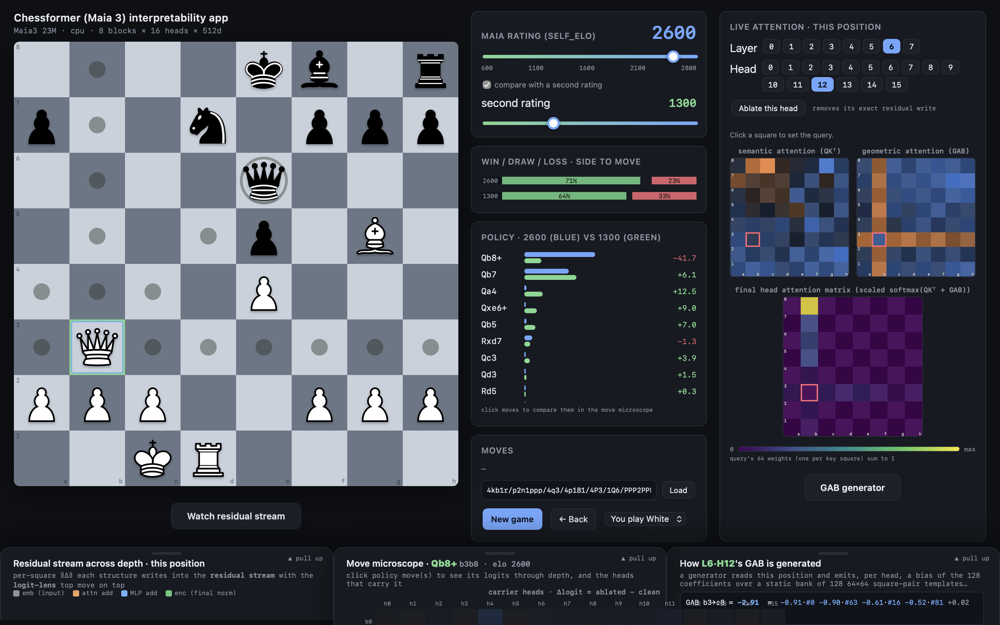
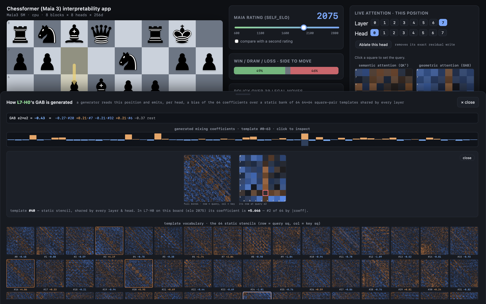
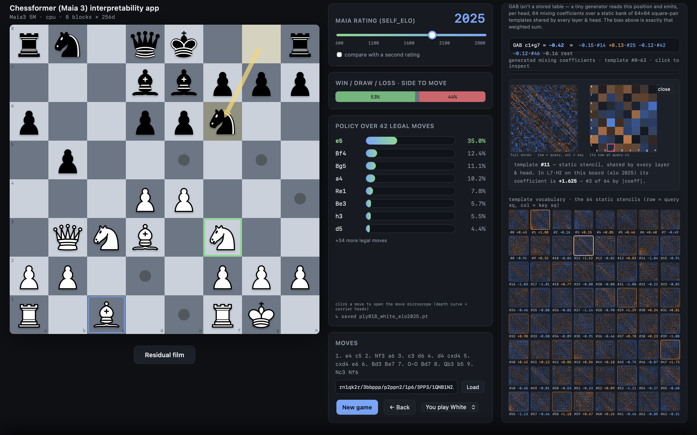
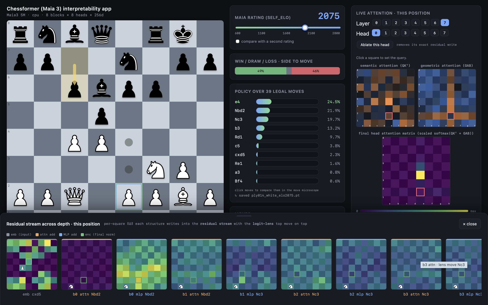
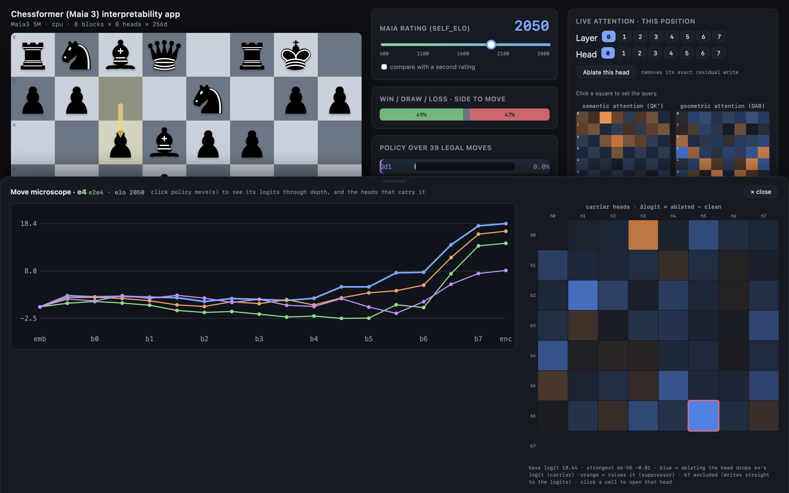
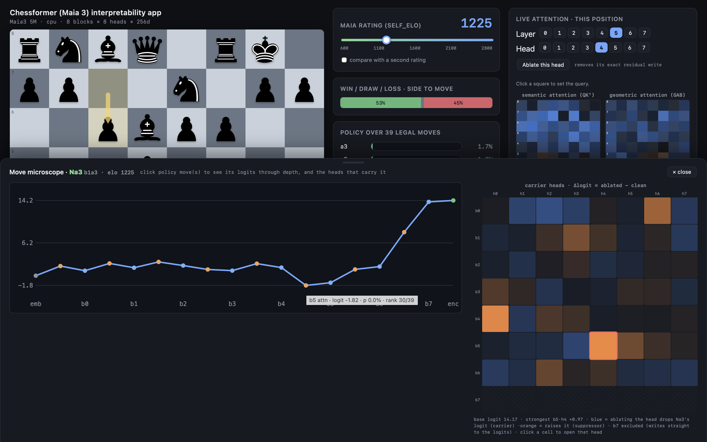

# App Guide:

**Play or Set up a Position**

Click to move your pieces. Select an Elo for the engine (Maia-3 is created to mimic how HUMANS play at that strength, with all of our innate biases)
and use `New game`, and a dropdown:`You play White` / `You play Black` / `Set up position`.
It is also possible to `paste a FEN to load` a position with the `Load` button. 

In setup mode both sides are yours; clicks move pieces ignoring legality, and clicking the same square twice deletes the piece. 
Select a color to continue as it from that position.

The last move is indicated by a gold arrow, legal moves for a selected piece are indicated by dots, captures are drawn as rings. The games
moves are recorded in SAN notation.

**Read the Position**

At the top in the center there is a `Win / Draw / Loss · side to move` stacked bar. 
Under it is the `Maia rating (self_elo)` slider: 600-2800, step 25, default 1500; Dragging reevaluates the same position. 
Under that is the scrollable ranked list: `Policy over N legal moves`. 

There is a `compare with a second rating` checkbox which reveals a `second rating` slider
(default 1100). Setting it makes the policy rows become paired blue/green bars showing the compared policy and evaluation. This second rating does not affect the attention or GAB or residual panel app features.

**Take the Model Apart**
Get the `Live attention · this position`, with `Layer` and `Head` chip rows.
Select a square on the right to set the query for the three boards, labeled:
-`semantic attention (QKᵀ)`
-`geometric attention (GAB)`
-`final head attention matrix (scaled softmax(QKᵀ + GAB))`
`Ablate this head` gives the top 8 moves by |Δp|.

Unique to the app and Maia-3, hover over any attention square and the GAB drawer decomposes that square pair live, with every head clickable to open that template:
 

**The Three Drawers**

+

One open at a time, each peeking at the bottom with a `▲ pull up` grip, `Escape` closes.

`Residual stream across depth · this position` — creates a filmstrip of mini
  boards at readout points in the forward pass where each square's heat denotes the ‖Δ‖ for the token. logit-lens' top move is in miniature display on top. Opened by the
  `Watch residual stream` button.

`Move microscope (and Carrier Heads)` — click up to 4 policy moves to overlay their depth curves (essentially logit lens narrowed to one policy); marker shows when a move sustains rank-1; per-dot hover
ex: `b3 mlp · logit 4.21 · p 38.2% · rank 1/31`.
`carrier heads` runs (layers x heads) forward passes with different ablated heads and record: `Δlogit = ablated − clean`.Hover for exact values. The largest Δlogit head is ringed red. The final layer is dimmed and striped, `excluded from carrier attribution`, because it writes straight to the logits and muddles meaningful results from earlier layers. 

`How L[i]H[j] GAB is generated` — see the network's generated linear combination of each template #0–63. `click to inspect`, and under
see `template vocabulary · the 64 static stencils (row = query sq, col = key sq)` as a gallery.
